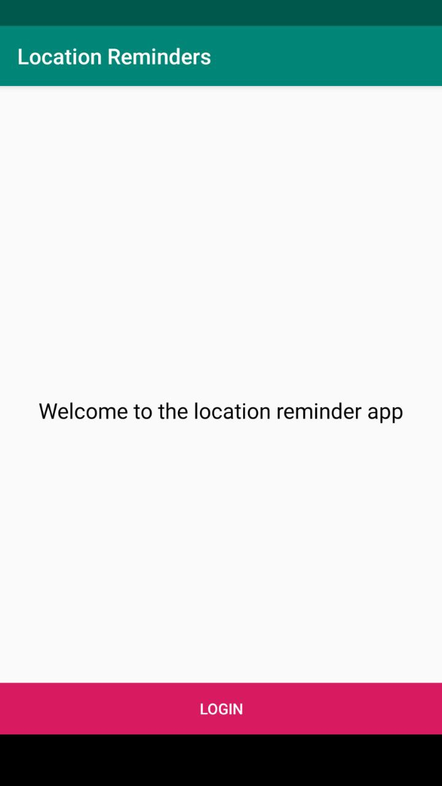
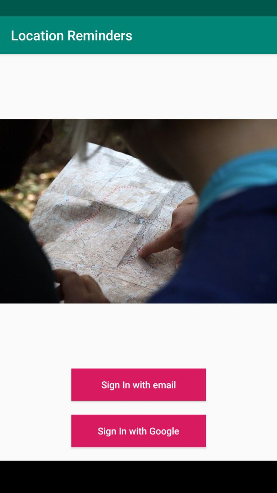
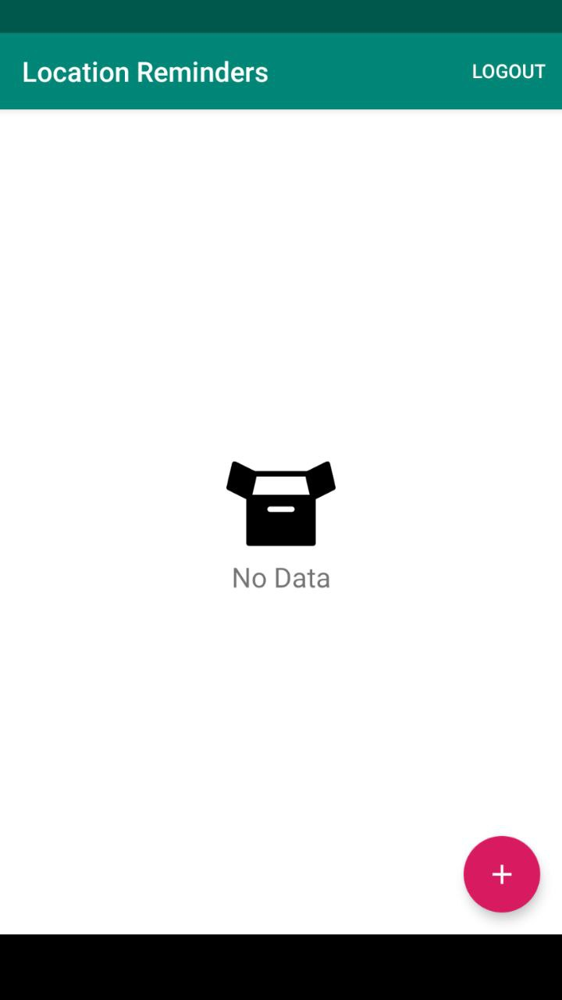
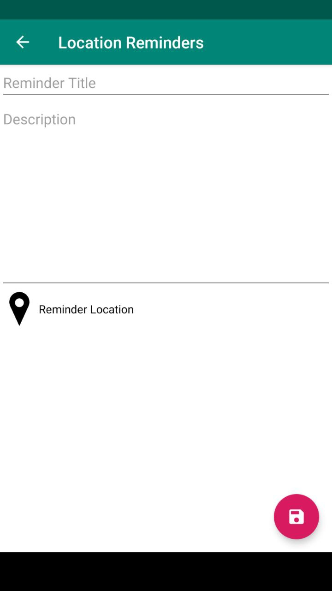
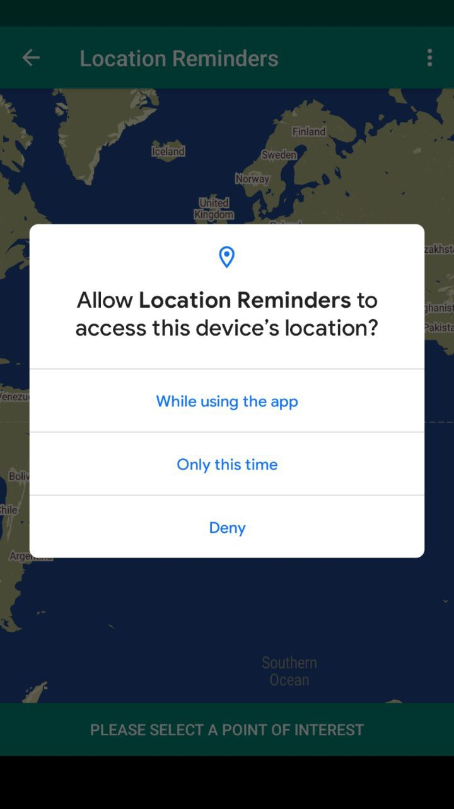
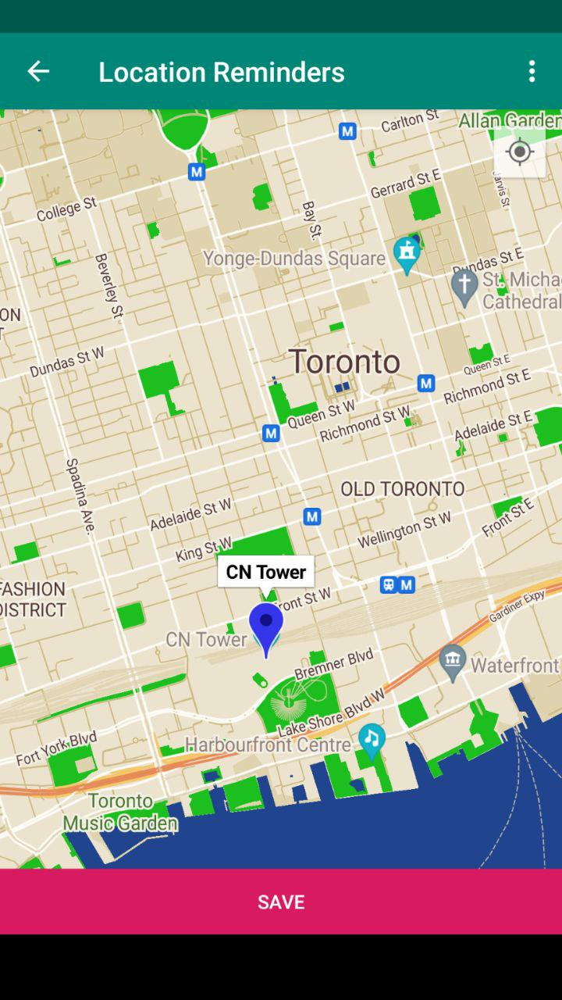
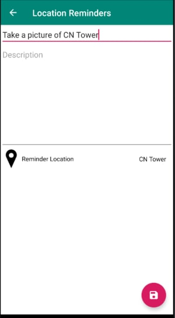
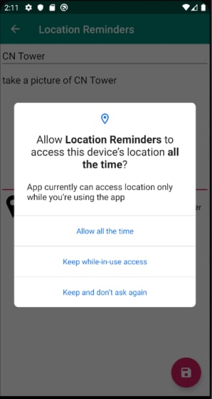
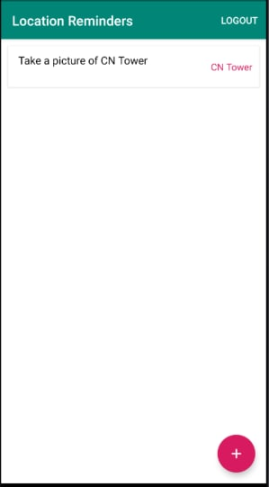
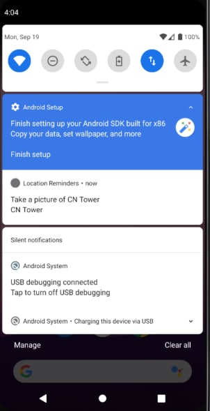

[Location Reminder](https://github.com/msbazzik/LocationReminder) is an Android Kotlin app which represents a TODO list with location reminders that
remind the user to do something when the user is at a specific location. The app will require the
user to create an account and login to set and access reminders.

## The app has been implemented with the following techniques:

- Login feature implemented using *Firebase Authentication* and *Firebase UI*.

- Integrated *Google Map* into the app, which provides different map types, has custom features such
  as styling, adding markers on point of interest(POI) and random locations, enabling location
  tracking.

- Using *Geofencing API* to define parameters of chosen location. When the device is entered the
  location, a broadcast message is sent out and the app gets a notification.

- [Room](https://developer.android.com/training/data-storage/room) persistence library and
  Repository layer to save the reminder to the local DB.

It leverages the following components from the *Jetpack* library:

* [ViewModel](https://developer.android.com/topic/libraries/architecture/viewmodel)
* [LiveData](https://developer.android.com/topic/libraries/architecture/livedata)
* [Data Binding](https://developer.android.com/topic/libraries/data-binding/) with binding adapters
* [Navigation](https://developer.android.com/topic/libraries/architecture/navigation/)

Testing:

- The app follows the MVVM design pattern and uses ViewModels to hold the live data objects, do the
  validation and interact with the data sources.

- Testing is provided for ViewModels, Coroutines, and LiveData objects. Using Dependency Injection,
  repository layer is easily replaced with FakeDataLayer that acts as a test double to test the app
  in isolation. 
  
- To test the app UI and Fragments Navigation Espresso and Mockito Frameworks are used. Testing for
  Snackbar and Toast messages provided.

- End to End Test used
  with [Espresso idling resources](https://developer.android.com/training/testing/espresso/idling-resource)
  to act as a synchronization mechanism for Espresso and the long running operations.

## Project consists of:

Location Reminder is built with a navigable interface consisting with multiple screens of
functionality. First, the app contains Login and Registration screens which allows users to login or
register using their email or a Google Account.

   
  

After the user logged in to the app, a screen with Reminders List retrieved from local storage is
displayed to user. If there are no reminders, a "No Data" indicator is displayed. On pressing FAB
user navigates from the Reminders list screen to Save Reminder screen to create a new reminder like
so:

    
  

On tapping *Reminder Location* view the app will navigate the user to Map View Screen and will ask
the user to allow the location permission to show his/her current location on the map. After
granting the permission the app will ask the user to select a point of interest (POI) on the map to
create a reminder:

   
  

Upon saving, the selected location is returned to the Save Reminder page and the user is asked to
input the title and description for the reminder. As the Geofencing API requires location to be
shared at all times, the app will also ask user for a background location permission upon pressing *
Save* FAB.

    
    

Once the title is entered, desired location is chosen and the background permission is granted, the
reminder is saved and a geofencing request is created:

   

When the user enters a geofence, a reminder is retrieved from the local storage and a notification
showing the reminder title will appear, even if the app is not open..

   

## Using Location Reminder App

1. Clone the project to your local machine.
2. Open the project using Android Studio.

3. There are some dependencies that are needed to use the project, here are the step-by-step
   instructions to get a dev environment running:

   3.1. To enable Firebase Authentication:
    - Go to the authentication tab at the Firebase [console](https://console.firebase.google.com/)
      and enable Email/Password and Google Sign-in methods.
    - Download *google-services.json* and add it to the app.

   3.2. To enable [Google Maps](https://developers.google.com/maps/documentation):
    - Go to APIs & Services at the Google console.
    - Select your project and go to APIs & Credentials.
    - Create a new api key and restrict it for android apps.
    - Add your package name and SHA-1 signing-certificate fingerprint.
    - Enable Maps SDK for Android from API restrictions and Save.
    - Copy the api key to the *google_maps_api.xml*

4. Run the app on your mobile phone or emulator with Google Play Services in it.

NOTE: A minimum of SDK API 29 on your device or emulator is required. 
